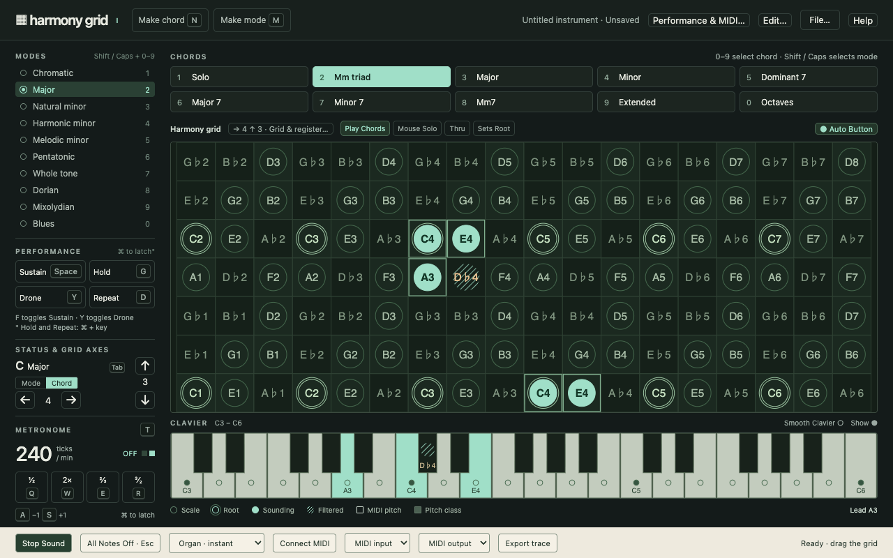

<p align="center">
  
</p>

# Harmony Grid

Harmony Grid is a playable browser instrument built to make harmony visible, tactile, and immediate. It reimagines the original Macintosh idea as a modern web instrument with real-time interaction and direct tactile control.

This version is grounded in the original manual and design intent: a grid where chords, modes, and rhythm become spatial relationships you can move through with the mouse, keyboard, or clavier.

## What it is

- A visual harmony instrument: move a chord root across the grid and hear notes activate or filter out based on mode logic.
- A performance surface: sustain, hold, drone, metronome, and keyboard controls work together for improvisation.
- A modern recreation: the same musical invitation as the 1989 original, with Web Audio, sampled and synthed voices, and responsive interaction.
- A real-time design: sound and visuals are kept synchronized so dragging remains immediate.

## Live experience

- Home: https://harmonygrid.org/
- Instrument: https://harmonygrid.org/play/
- About page: https://harmonygrid.org/about.html
- Sound + software credits: https://harmonygrid.org/credits.html

## Historical note

Harmony Grid was created by **Ethan Joffe** in the Experimental Music Studio at the **MIT Media Lab** around 1989 and published by **Hip Software Corporation**. It was founded with **David Levitt** of Hip Software as cofounder and original grid concept contributor.

The recreation is inspired by the original documentation and workflow, including the idea that you can be learning and playing at the same time through spatial note layouts, selectable chords and modes, and a live performance surface.

## Build and run

### Development

```bash
npm install
npm run dev
```

### Build and publish the website package

```bash
node website/build.mjs
/Users/ethan/.agents/skills/here-now/scripts/publish.sh dist/site --slug cedar-huckle-g5zg --client codex
```

The curated publish bundle includes:

- Home and About pages
- Play page entrypoint
- Credits and licenses
- Original manual PDF
- Historical scan page captures

Private run artifacts, credentials, and local debug logs are excluded from publish output.

## Source map

- `src/` — instrument application
- `website/` — marketing/about site and static pages
- `dist/site/` — generated publish bundle
- `website/harmonygrid.pdf` — original Users’ Guide scan
- `tests/` — existing automated checks for core modules and rendering/audio behavior

## Credits and audio

- Sampled palette from GeneralUser GS (reduced selection for this recreation)
- SpessaSynth Core for sampled playback
- See `website/credits.html` and included license files for full attribution.
