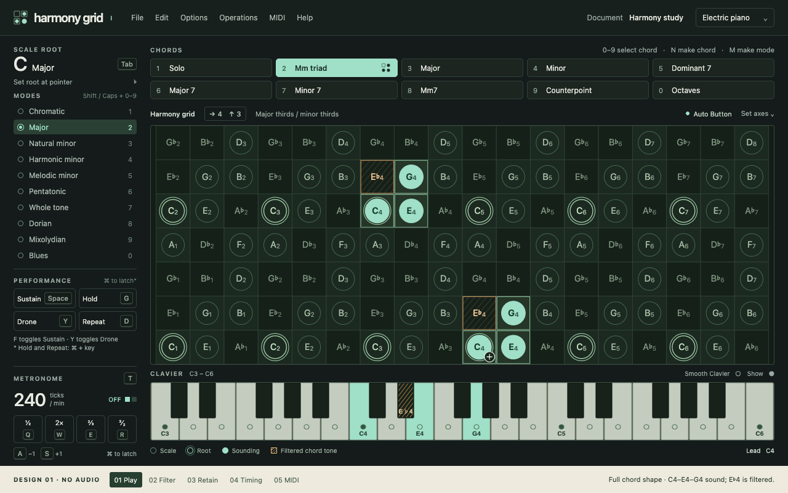
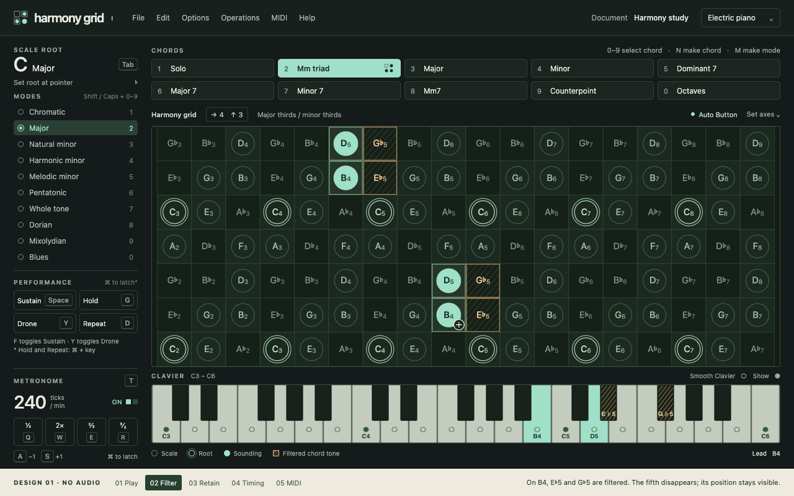
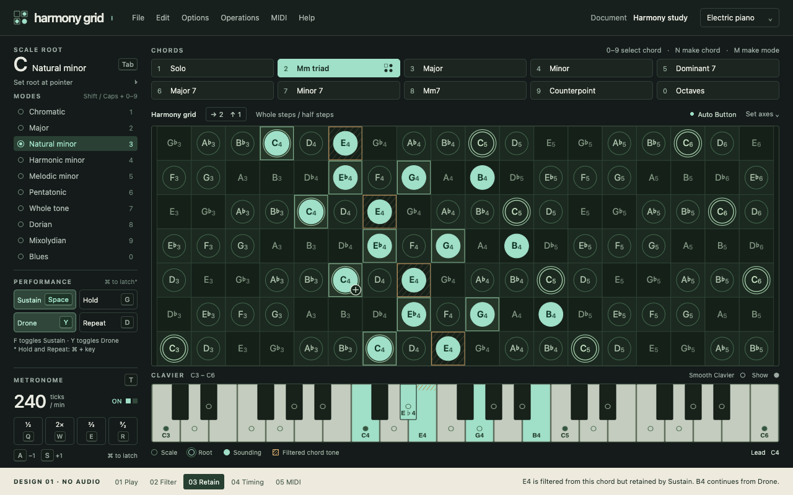
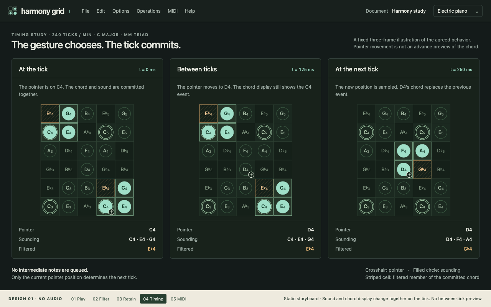
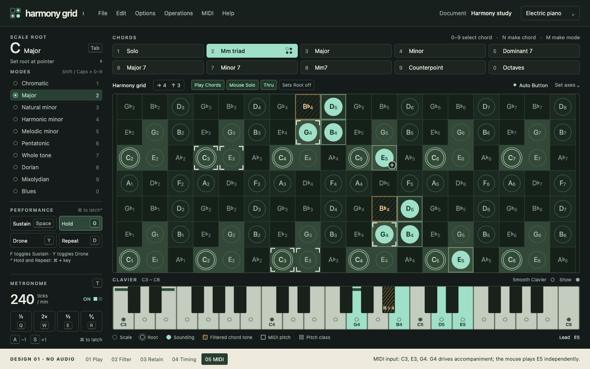

# Harmony Grid — design review 01

Status: design review 01 accepted by Ethan on 2026-09-05 as the visual baseline for the first playable prototype. All five playing states and the overall surface have been reviewed. Actual responsiveness and playing feel remain to be evaluated. Created 2026-09-05.

Open [the local prototype](index.html) and use the cream footer to switch among five fixed states. The footer is a review aid, not part of the proposed instrument. All musical controls are illustrations; there is no audio, MIDI connection, scheduler, or live dragging. These renders do not establish real-time performance or full feature parity.

The design follows the original spatial arrangement: chords above the grid, modes and performance status to its left, and clavier below. The overall layout, palette, scale/root markers, control placement, and clavier size are accepted as the prototype baseline. Example document and slot contents are synthetic fixtures, not recovered original documents. The manual and [corrected requirements](../requirements.md) remain the behavioral sources.

## Review images

Each image below is 1280 × 800 pixels at device scale 1. A second set at 1600 × 1000 provides a larger comparison; neither size is a measurement of Ethan's display. The grid cells remain square. The larger surface adds a row. Final targeting density, zoom, clavier range, and actual display size still need review during instrument development.

### 01 — Playing surface

The generic major/minor triad at C4 contains C4, E♭4, E4, G4. In C major, C4/E4/G4 sound and E♭4 is filtered. Repeated appearances of the same exact pitch share the same state. The selected scale root is C; the crosshair marks the pointer's lead pitch independently.

[Larger render](1600x1000/01-playing-surface.png)

### 02 — Filtered chord

At B4 in C major, B4/D5 sound while E♭5/G♭5 are filtered. This preserves the manual's missing-fifth example: G♭5 remains visible as a filtered chord member. Flat spelling is deliberately consistent across these fixtures, rather than attempting contextual enharmonic spelling.

[Larger render](1600x1000/02-filtered-chord.png)

### 03 — Retained notes after a scale change

The 2×1 grid shows C natural minor. The current chord sounds C4/E♭4/G4 and filters E4. Earlier E4 remains under Sustain and B4 under Drone, even though both are outside the current scale. All sounding pitches use the same filled marker. E4 carries both the sounding circle and filtered-cell pattern; the clavier likewise combines a filled key with a small hatch strip.

[Larger render](1600x1000/03-retained-notes.png)

### 04 — Tick transition

This is a fixed storyboard, not an animation or timing measurement. At 240 ticks/minute, the illustrated tick interval is 250 ms. The pointer moves C4 → D4 between ticks while the displayed chord remains C4/E4/G4 with E♭4 filtered. At the next tick, D4/F4/A4 sound and G♭4 is filtered. The scale root remains C throughout. No pending chord is previewed.

[Larger render](1600x1000/04-tick-transition.png)

### 05 — MIDI and mouse together

Incoming C3/E3/G4 are held; G4 is the most recent trigger. With Play Chords on, its accompaniment is G4/B4/D5 with B♭4 filtered. Mouse Solo adds E5 independently. Exact incoming pitches have square corner marks; all octave equivalents of incoming C/E/G have a muted square fill. A dark bar marks the actual input keys on the clavier, while mint indicates the internally generated/sounding set. The input indicators show a committed tick state. Immediate MIDI Thru timing cannot be demonstrated by this still image.

[Larger render](1600x1000/05-midi-and-controls.png)

## Proposed visual legend

| Mark | Meaning |
| --- | --- |
| Hollow circle | Pitch belongs to the current scale |
| Double circle | Scale-root pitch class across octaves |
| Filled mint circle/key | Sounding pitch, including retained sound |
| Outlined grid cell | Member of the current chord/event |
| Amber hatched cell/key | Current chord member rejected by the scale filter |
| Crosshair | Pointer position; not a pending-chord preview |
| White square corners | Actual incoming MIDI pitch |
| Muted green square | Octave equivalent of an incoming MIDI pitch |
| Highlighted performance control | Active control, independent of the sounding-note appearance |

Filtered membership and sounding state are independent when a retaining control keeps an otherwise filtered pitch alive. Shapes and hatching supplement color; accessibility and comfort still require user evaluation.

## Source references and editable files

- [Manual](../harmonygrid.pdf), printed [page 13](reference/manual-page-13.png): original surface arrangement; [page 14](reference/manual-page-14.png): grid symbols and played/filtered chord members; [page 70](reference/manual-page-70.png): incoming MIDI pitch and octave-equivalent visualization. The PNGs are reference page renders from the supplied PDF.
- [Requirements](../requirements.md) and [browser feasibility plan](../browser-feasibility-plan.md): corrected behavior and implementation gates.
- [index.html](index.html), [mockup.css](mockup.css), [mockup.js](mockup.js): editable static mockup and explicitly selected fixture data. No external assets or network requests are required.
- [render.mjs](render.mjs): repeatable local capture using installed Chrome and Node 22+; no package installation. From the repository root, run `node docs/prototypes/render.mjs` to regenerate the ten images and QA data. It uses and removes its own browser profile under this directory.
- [render-manifest.json](render-manifest.json): exact browser version, output files, and dimensions. [visual-qa.json](visual-qa.json): captured fixture states, DOM pitch flags, viewport measurements, and layout checks.

## Verification and revisions

Rendered with Chrome 152.0.7977.76 at both declared CSS viewport sizes, device scale 1. All ten PNGs were visually inspected. Browser viewport and PNG dimensions agree; checked controls and SVG labels remain inside the instrument, button text does not overflow, and document height fits the viewport.

An independent comparison of the captured DOM flags against the explicit pitch sets described above passed for all ten renders. It checked sounding/filtered membership on both grid and clavier, consistency among repeated exact pitches, and each of the three timing panels separately. MIDI square/corner overlays were inspected visually. These are static fixture checks, not tests of an instrument engine, MIDI routing, audio timing, live rendering, or input behavior.

Revisions before this review:

1. Widened the compact sidebar and tightened its mode/control spacing so the metronome keys remain visible at 1280 × 800.
2. Moved MIDI status chips into the grid header to preserve space for performance controls.
3. Corrected storyboard height so it fits above the review footer.
4. Made retained-and-filtered E4 visible simultaneously on grid and clavier.
5. Captured browser metrics and PNGs at the same explicitly set viewport to avoid headless browser window-size discrepancies.

## Acceptance record

| Area | Status |
| --- | --- |
| Grid density | Accepted by Ethan, 2026-09-05 |
| Sounding versus filtered chord-tone distinction | Accepted by Ethan, 2026-09-05 |
| Overall layout, palette, and clavier proportions | Accepted as the playable-prototype baseline by Ethan, 2026-09-05 |
| Scale and root markers | Accepted as the playable-prototype baseline by Ethan, 2026-09-05 |
| Retained pitches sharing the sounding-note appearance, including filtered-but-still-sounding overlap | Accepted for this prototype by Ethan ("Good enough"), 2026-09-05 |
| Tick storyboard and pointer treatment | Accepted by Ethan, 2026-09-05: pointer moves immediately; complete chord display and sound change together at the next tick |
| MIDI indicators: exact incoming pitches, octave equivalents, and sounding notes | Accepted by Ethan, 2026-09-05 |
| Performance-control placement | Accepted as the playable-prototype baseline by Ethan, 2026-09-05; actual discoverability and feel remain to be evaluated |
| Actual target Mac viewport | Not yet recorded |
| Requested revisions | None received for this proposal yet |
| Design gate | Complete; use this revision as the visual reference for the first playable prototype |
| Application implementation | Initial playable foundation implemented; see the [evaluation report](../feasibility-report.md). Physical response and hands-on playing remain unverified. |

The first response accepted grid density and the distinction between sounding and filtered chord tones. The retained-note overlap was subsequently accepted as good enough for this prototype: E4 is filtered from the current chord yet continues sounding under Sustain. Ethan then confirmed the tick storyboard, MIDI indicator distinctions, and overall surface as the baseline for the first playable prototype. These are design judgments; actual clarity while playing and real-time response remain untested. No visual revisions were requested. Preserve these accepted renders as implementation references. Capture authoring, document dialogs, settings, and remaining full-product workflows in subsequent design passes before implementing those interfaces.
